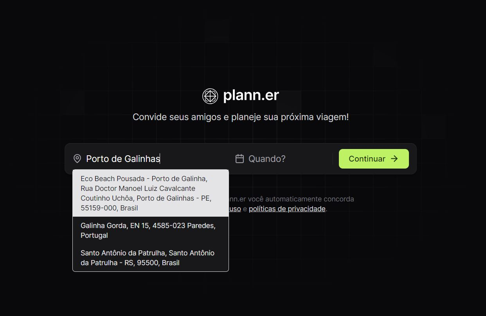

# NLW - Journey: Projeto Plann.er 🗺️🛩️

**Plann.er** é uma aplicação inovadora de planejamento de viagens que permite organizar todas as suas aventuras com facilidade. Com Plann.er, você pode:

- Convidar amigos que participarão da viagem
- Registrar as atividades diárias e seus respectivos horários
- Adicionar links de informações úteis, como regras do AirBNB, entre outros

## 📝 Funcionalidades e Desafios

Neste projeto, me desafiei implementando:

- **Múltiplas adições de e-mail**: Facilita o envio do convite para os amigos separando com uso de ',' ou ';'.
- **API de Geolocalização da Opencage**: Facilita a busca e seleção de locais.
- **Lib Datapicker**: Permite a seleção de datas e horários através de uma interface de usuário intuitiva.

### 🌎 Ativação do Autocomplete

Para ativar o autocomplete, é necessário criar uma conta gratuita no OpenCage e configurar o arquivo `.env`. Um modelo de template do arquivo `.env` está disponível na árvore `web` do repositório.

## 👨‍💻 Autor

[Gustavo Teixeira](https://github.com/taylosstls)  
[LinkedIn](https://www.linkedin.com/in/gustavoteixeiralgnt/)  
[Instagram](https://www.instagram.com/gustavo.lgnt/)
